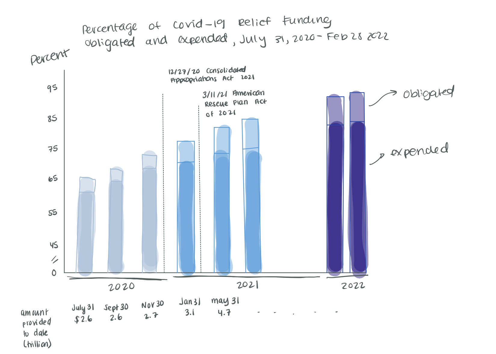

# Step one: Find a data visualization

For this assignment I decided to use a graph that I found in the Government Accountability Office’s (GAO) report titled “Covid-19: Current and Future Federal Preparedness Requires Fixes to Improve Health Data and Address Improper Payments.” I decided to use a graph from a GAO report because I interned there last summer so I thought that it would be interesting to try and critique a data visualization from a source that I am familiar with. The graph, which is titled "Percentage of COVID-19 Relief Funding Obligated and Expended, July 31, 2020-Feb. 28, 2022" plots the amount of COVID-19 relief funding that was expended versus obligated. In addition, the data visualization includes other information such as the amount of relief funding provided to date and highlight important legislation that was passed. Overall, this is not a bad data visualization graphic but it does fall into some pitfalls such as repitition and poor color choice that if fixed could really help this graphic communicate this important informaiton in a more efficient manner. 

# Step two: Critique the data visualization

##  Usefulness - 9

The intended audience for this graph is Congress. I think that the content of the graph is valuable to decision makers in government if they are trying to get an idea of how much COVID-19 relief funding has been used. Additionally, I like how the original graph includes call outs to pieces of legislation that are relevant to the subject matter (such as the American Rescue Plan). I think that how cluttered the graph is is harmful especially considering the fact that the intended audience are policy makers who don't have much time to try and decipher everything that is being presented in this graph. Overall, I think that this graph is really useful, which is why I evaluated it at a 9, but that it could take in account the amount of time that its audience has and try and streamline the information it is trying to communicate. 

##  Completeness - 9

I think that the visualization has everything necessary to make it understandable but that sometimes it overloads the viewer with information. Examples of this include the repitition of the "provided to date," the fact that the y axis is the percent but also the percentage is liseted above each of the lines. Additioanlly, I think that some of the design choices make it less understandable. For example, the black like that is denoting what year each of these dates is part of is hard to follow. The different text treatment, such as inclusing a dark background just for the amount of money provided to date and staggering those dates, also makes the graphic seem busier and harder to read than it is. 

##  Perceptibility - 4

I gave this visualization a 4 in terms of perceptibility because I feel like there is an overload of information. The different fonts and the many types of dates make it more dificult to get the information that you are itnerested in. I do think that the line graph is an appropriate type of visualization fo this type of information. It really does highlight the difference in the obligated and expended funds and havign all the points connect easily allows the viewer to see the overall trend in the data. The reason for this low score though was because of the amount of information that is being repeated in the graphic. 

##  Truthfulness - 10

For truthfulness I gave this graph a perfect 10 because I feel like it is not trying to mislead the reader and additionally I really like the work that GAO puts out and I know that it is a nonpartisan agency. Additionally, I don't see any issues with the scale of this graph and I actually really appreciate the fact that they included the "//" to skip over 0-45 on the y axis since there is no need to see those numbers. 

##  Intuitiveness - 3

This graphic has a low intuititivness score because of the fact that there is a lot of information in it and it is pretty 

##  Aesthetics- 3

I gave this graphic a 3 for aesthetics due to many of the issues I have with how cluttered it is. Most of these issues I have called out in the sections above but some of the purely aestheic issues I have with the graphic include the deicison to make the expended line dashed and the obligated line solid. I feel like the expended line should be solid because that money has been spent whereas it would be more appropriate to make the obligated line dashed because that money has simply been committed to something but has not yet been spent. Though this is a small point I think that these subtle aesthetic cues could really help viewers understand the impact of the data being providided. Additionally, I feel like 

##  Engagement - 6

I gave this graphic a 6 for engagement because I feel like it achieves its goal of communicating information on COVID-19 relief funding but that the informaiton isn't telling much of a story. I think that it is a missed opportunity to have all the data on the funding amounts and to not include that in the graph. Since it is just text it is hard to tell what the trends are.

# Step three: Sketch out a solution

# Step four: Test the solution

# Step five: Build your solution
