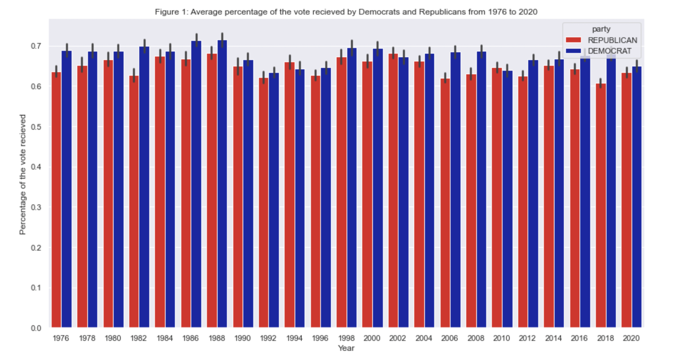
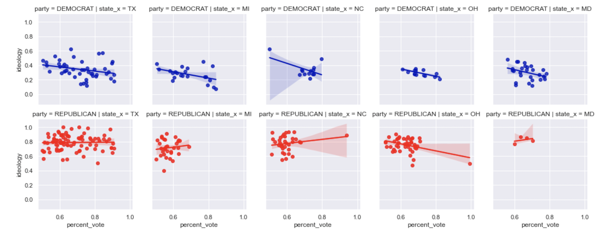
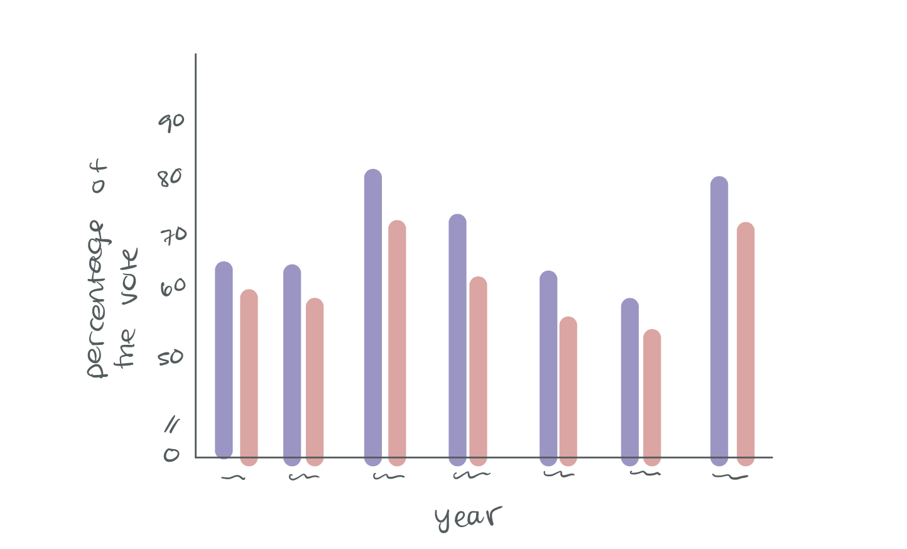
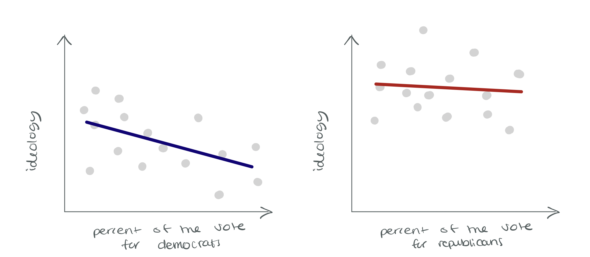
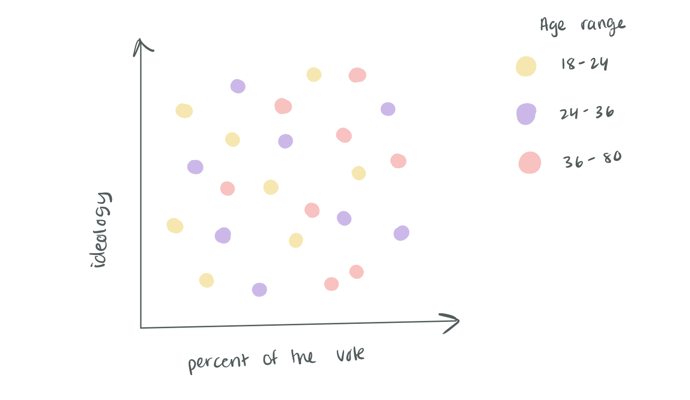
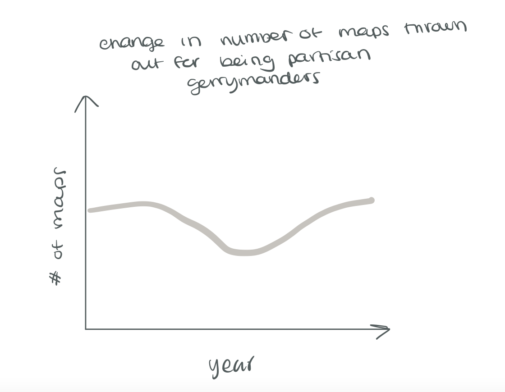

# Final Project Part 1

## Outline

### Summary

For my final project I plan to rework an article I wrote for my Voting Rights class last semester. I wrote an article about the impact of gerrymandering in which I included data visualizations from a dataset that I created myself by merging preexisting datasets. My overall topic will be on gerrymandering and the map making process in the US. I will create graphs using the dataset that I put together as well as graphs using Congressional District shapefiles. The plan for my final project is to put together a cohesive policy data story on the intended and unintended impacts of gerrymandering and to improve on the graphics that I initial created for my other class. 

I have included above an image of my story arc for the presentation. I think it will start out with people being pretty ambivilant since we already hear a lot about gerrymandering in the news. The next step is further down as I introduce images of gerrymandered districts and talk more about the impacts. And then it will start to go up as we look further into the data and into the unintended impacts of gerrymandering. Finally, the presentation will end at the highpoint where I go over what steps we can take. 

## Initial sketches

### Original designs

Below I have included some of my original graphs which I used in my assignment. I hope to rework these graphs in addition to making new graphs that really showcase what the data is saying. I want to use the skills that I have learned throughout this class as well as the new platforms that I have learned how to use, to really do this data justice. 

### Redesigns

Below are some of my redesign ideas for the final project. 

### New designs

## The data

Original data set: This dataset was created by merging data from the [MIT Election Lab](https://dataverse.harvard.edu/dataset.xhtml?persistentId=doi:10.7910/DVN/IG0UN2) and the ideology scores for different representatives from [voteview](https://voteview.com/data). This data is different than what I used in my intial data visualizations (which I showed above) since I used a different metric to measure ideology in those graphs. I cleaned and merged the dataset myself. 

Additionally, I might merge the dataset I created with a shapefile in order to be able to graph the data that I have in map format. One source that I could use is this [United States Congressional Distrcit Shapefile](https://cdmaps.polisci.ucla.edu/) dataset that I came across.

Census: I might merge my dataset on data from the [Census](https://www.census.gov/data/tables/time-series/demo/voting-and-registration/congressional-voting-tables.html) on the voting rates for congressional districts as well as the second dataset on that site which shows the differne proportion of ages of individuals who voted in 2018. This would possibly show more of the unintended consequences of gerrymandering. For example, if I did a graph that showed the percentage of a certain agae range that turned out in the election for a representative in 2018 versus their ideology. 

Dave's Redistricting: I am possibly going to use some images of districts from [Dave's](https://davesredistricting.org/maps#home) since it is pretty powerful with regards to showing different districts and what they look like. 

Other possible datasets include data on voter turnout 

## Method and medium

I plan on completing my final project by using Shorthand. While I feel like this data would do better with a FiveThirtyEight type of data story, I feel like pushing myself to use shorthand will allow me to explore how to be more creative with this information and how to really craft a narrative. 

[Home](/README.md)
