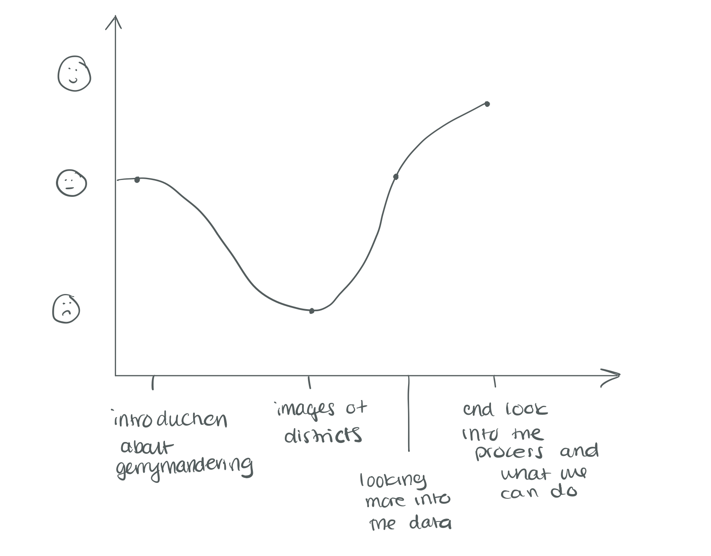

# Final Project Part I

## Outline

### Summary

For my final project I plan to rework an article I wrote for a class on voting rights that I took last semester. I wrote an article about the impact of gerrymandering in which I included data visualizations from a dataset that I created by merging preexisting datasets on vote percentage and the ideology rating of representatives. My overall topic will be on gerrymandering and the map making process in the US. I will create various graphs that show the relationship between the percentage of a vote a candidate receives versus their ideology. The plan for my final project is to put together a cohesive policy data story on the intended and unintended impacts of gerrymandering and to improve on the graphics that I initially created for my other class. 

I have included above an image of my story arc for the presentation. I think that the data story will start out with people being pretty ambivalent since we already hear a lot about gerrymandering in the news. The next step is further down as I introduce images of gerrymandered districts and talk about the history of gerrymandering in the US. Finally, towards the end it will start to go up as we look further into the data and into the unintended impacts of gerrymandering. The presentation will end at the highpoint where I go over what steps we can take to combat this issue. 

## Initial sketches

### Original designs

Below I have included some of the graphs that I used in the original assignment. I hope to rework these graphs in addition to making new graphs that really showcase what the data is saying. I want to use the skills that I have learned throughout this class as well as the new platforms that I have learned how to use to really do this data justice. Some of the issues with these graphs is that I created them within Python which means that I did not have much control over the aesthetics. Additionally, these graphs were more about exploring the data than telling a story. I was really excited to see if my hypothesis was held up by the data that I didn't think about how these graphs would be seen by viewers who were not as invested. 

### Redesigns

Below are some of my redesign ideas for the final project. I plan on shortening the y axis for the bar graph and making the dot plots less busy by making the dots a gray and only using color for the trend line. Additionally, I am going to try and use a more neutral background color so that the blue and red do not look as striking and to get away from a red, white, and blue color scheme. These are all ideas that I got from my group during the in-class critique. 

### New designs

My new designs include a graph that shows the ideology of a representative plotted against the percentage of the vote they received from different age groups. The second design is more of a placeholder since I need to understand what data I can collect but I want a representation of the number of maps that have been rejected due to being partisan gerrymanders. I think that creating maps is a part of the redistricting process that is often overlooked since it only happens every 10 years so I want to make sure to highlight it. One item that I need to figure out is what the color scheme will be for these new designs. All of my old graphs used the colors of the political groups, but I also want to include some data visualizations that are more neutral. I think that this will help to not distract the viewer and keep the focus on the data. I also want to include some infographics that explain key concepts related to gerrymandering such as cracking and packing. 

## The data

Original data set: This dataset was created by merging data from the [MIT Election Lab](https://dataverse.harvard.edu/dataset.xhtml?persistentId=doi:10.7910/DVN/IG0UN2) and the ideology scores for different representatives from [voteview](https://voteview.com/data). This data is different from what I used in my initial data visualizations (which I showed above) since I used a different metric to measure ideology in those graphs. I cleaned and merged the dataset myself. 

Additionally, I might merge the dataset I created with a shapefile in order to graph the data that I have in a map format. One source that I could use is this [United States Congressional District Shapefile](https://cdmaps.polisci.ucla.edu/) dataset that I came across.

Census: I might merge my dataset on data from the [Census](https://www.census.gov/data/tables/time-series/demo/voting-and-registration/congressional-voting-tables.html) on the voting rates for congressional districts as well as the second dataset on that site which shows the different proportion of ages of individuals who voted in 2018 by district.

Dave's Redistricting: I am possibly going to use some images of districts from [Dave's](https://davesredistricting.org/maps#home) since it will allow me to show different districts and what they look like. 

## Method and medium

I plan on completing my final project by using Shorthand. While I feel like this data would do better with a FiveThirtyEight type of data story, I feel like pushing myself to use Shorthand will allow me to explore how to be more creative with this information and how to really craft a narrative. I think it will also allow me to use text to highlight important statistics and to include infographics that explain concepts such as cracking and packing. 

[Home](/README.md)
